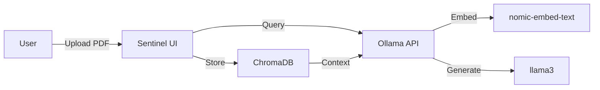

# Sentinel Private AI

**A secure, on-premise document chatbot. Upload PDFs and query them locally using AI.**

  

## Overview

Sentinel Private AI is a privacy-first document intelligence system that allows you to upload PDFs and query them using a local Llama-3 model. All processing happens on your infrastructure - your documents never leave your server.

## Features

- **100% Private**: All data stays on your infrastructure
- **RAG Pipeline**: Retrieval-augmented generation for accurate answers
- **Local LLM**: Uses Ollama with Llama-3 for inference
- **PDF Support**: Upload and index PDF documents
- **Real-time Chat**: Interactive chat interface with source citations
- **Military-Grade UI**: Dark theme with glassmorphism design

## Architecture



## Tech Stack

| Component | Technology |
|-----------|------------|
| Frontend | Next.js 14, React, Tailwind CSS, Framer Motion |
| Vector DB | ChromaDB |
| LLM | Llama-3 (via Ollama) |
| Embeddings | nomic-embed-text |
| PDF Parsing | pdf-parse |

## Prerequisites

- Node.js 18+
- Ollama running locally with models:
  - `ollama pull llama3`
  - `ollama pull nomic-embed-text`

## Installation

```bash
# Clone the repository
git clone https://github.com/Fronter-xd/sentinel-private-ai.git
cd sentinel-private-ai

# Install dependencies
npm install

# Start Ollama (separate terminal)
ollama serve

# Run the development server
npm run dev
```

Open [http://localhost:3000](http://localhost:3000) to start using Sentinel.

## Environment Variables

Create a `.env.local` file:

```env
OLLAMA_BASE_URL=http://localhost:11434
OLLAMA_EMBEDDING_MODEL=nomic-embed-text
OLLAMA_LLM_MODEL=llama3
UPLOAD_DIR=./public/uploads
CHROMA_PATH=./data/chroma
```

## Usage

### 1. Upload a PDF

Drag and drop a PDF file into the upload area. The document will be parsed, chunked, and indexed.

### 2. Ask Questions

Type your questions in the chat interface. Sentinel will search the indexed documents and generate answers with source citations.

### 3. Review Sources

Click on "X sources" to expand and view the relevant document passages that informed the answer.

## Project Structure

```
sentinel-private-ai/
├── app/
│   ├── api/
│   │   ├── upload/route.ts   # PDF upload endpoint
│   │   ├── chat/route.ts     # Chat/RAG endpoint
│   │   └── status/route.ts   # System status
│   ├── page.tsx              # Main application
│   └── layout.tsx            # Root layout
├── components/
│   ├── ui/                   # UI components
│   ├── chat/                 # Chat components
│   ├── upload/               # Upload components
│   └── layout/               # Layout components
├── lib/
│   ├── chroma.ts             # ChromaDB client
│   ├── ollama.ts             # Ollama API client
│   ├── rag.ts                # RAG pipeline
│   ├── pdf.ts                # PDF processing
│   └── utils.ts              # Utilities
└── public/
    └── uploads/              # Uploaded files
```

## API Endpoints

### POST /api/upload
Upload a PDF file for indexing.

```bash
curl -X POST -F "file=@document.pdf" http://localhost:3000/api/upload
```

### POST /api/chat
Send a query to the RAG pipeline.

```bash
curl -X POST -H "Content-Type: application/json" \
  -d '{"query": "What is this document about?"}' \
  http://localhost:3000/api/chat
```

### GET /api/status
Check system status.

```bash
curl http://localhost:3000/api/status
```

## Privacy

- All document processing happens locally
- No data is sent to external servers
- ChromaDB stores embeddings locally
- Ollama runs inference on your machine
- Uploaded files are stored in your local filesystem

## License

MIT License

## Contributing

Contributions welcome! Please open an issue or submit a pull request.
